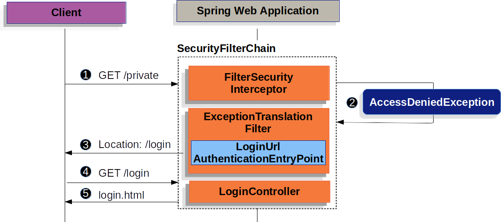

# Form Login

Spring Security provides support for username and password being provided through an HTML form. This section provides details on how form based authentication works within Spring Security.

This section examines how form-based login works within Spring Security. First, we see how the user is redirected to the login form:

    Figure 1. Redirecting to the Login Page
    The preceding figure builds off our SecurityFilterChain diagram.

    1. First, a user makes an unauthenticated request to the resource (/private) for which it is not authorized.

    2. Spring Security’s AuthorizationFilter indicates that the unauthenticated request is Denied by throwing an AccessDeniedException.

    3. Since the user is not authenticated, ExceptionTranslationFilter initiates Start Authentication and sends a redirect to the login page with the configured AuthenticationEntryPoint. In most cases, the AuthenticationEntryPoint is an instance of LoginUrlAuthenticationEntryPoint.

    4. The browser requests the login page to which it was redirected.

    5. Something within the application, must render the login page.

## When the username and password are submitted, the UsernamePasswordAuthenticationFilter authenticates the username and password. The UsernamePasswordAuthenticationFilter extends AbstractAuthenticationProcessingFilter, so the following diagram should look pretty similar

    Figure 2. Authenticating Username and Password
    The figure builds off our SecurityFilterChain diagram.

    1. When the user submits their username and password, the UsernamePasswordAuthenticationFilter creates a UsernamePasswordAuthenticationToken, which is a type of Authentication, by extracting the username and password from the HttpServletRequest instance.

    2. Next, the UsernamePasswordAuthenticationToken is passed into the AuthenticationManager instance to be authenticated. The details of what AuthenticationManager looks like depend on how the user information is stored.

    3. If authentication fails, then Failure.

    The SecurityContextHolder is cleared out.

    RememberMeServices.loginFail is invoked. If remember me is not configured, this is a no-op. See the RememberMeServices interface in the Javadoc.

    AuthenticationFailureHandler is invoked. See the AuthenticationFailureHandler class in the Javadoc

    4. If authentication is successful, then Success.

    SessionAuthenticationStrategy is notified of a new login. See the SessionAuthenticationStrategy interface in the Javadoc.

    The Authentication is set on the SecurityContextHolder. See the SecurityContextPersistenceFilter class in the Javadoc.

    RememberMeServices.loginSuccess is invoked. If remember me is not configured, this is a no-op. See the RememberMeServices interface in the Javadoc.

    ApplicationEventPublisher publishes an InteractiveAuthenticationSuccessEvent.

    The AuthenticationSuccessHandler is invoked. Typically, this is a SimpleUrlAuthenticationSuccessHandler, which redirects to a request saved by ExceptionTranslationFilter when we redirect to the login page.
